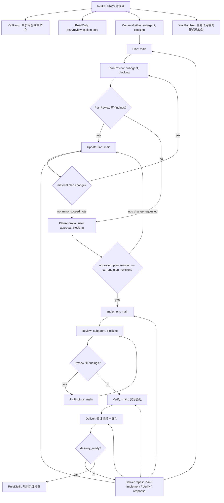

# dev-pipeline

`dev-pipeline` 是高约束工程流水线 skill，用于需要读取 repo 上下文、跨阶段推进并交付验证结果的开发任务。它面向 agent 执行多步工程工作，不是通用聊天、单命令查询或低风险单文件改动的默认包装器。

## 适用场景

- 代码实现、bug 调试、重构、代码审查、TDD/test-first、技术文档同步。
- 涉及多模块、状态流、外部 contract、side effects、权限/数据流或用户可见行为的任务。
- 需要明确经历理解上下文、方案、实现、验证、交付这些阶段的工作。

## 默认边界

- `plan only` / `review only` / `explain only` 保持只读，不创建任务台账，不改文件，不 stage，不 commit。
- 单文件低风险任务走轻量路径，不启动子代理、不切片、不创建任务台账、不强制执行计划批准。
- 提交保持显式授权。只有用户明确要求提交，或交付 diff 后确认提交，才允许 commit；push 同理。
- 删除、覆盖、迁移、部署、发送消息、批量写入、联网改状态、付费调用等高副作用操作必须先确认。

## 阻塞式状态流

高约束实现任务使用上下文、方案审查、用户批准和实现审查关卡。子代理在审查关卡里是 blocking actor，不是旁路建议；用户批准关卡决定当前计划版本是否允许进入写入。

关卡语义：

- `ContextGather` 只打包 repo 证据、入口、contract、风险和未解问题，不替主线程定方案。
- `Plan` 生成 `.dev-pipeline/<date>-<short-slug>/plan.md`；`.dev-pipeline/<date>-<short-slug>/task.md` 记录任务台账。
- `PlanReview` 审查执行计划、上下文证据和关键 contract；有实质 findings 时先改方案，重大方案变化重新 review。
- `PlanApproval` 等待用户批准当前计划版本；`approved_plan_revision == current_plan_revision` 后才允许进入 `Implement`。
- `Implement` 默认由主线程执行；只有已批准计划内的明确切片可交给写入型 worker，并且必须绑定 ownership、计划版本和 handoff。
- `Review` 审查实现 diff 和验证覆盖；有 findings 时修复后再 review。
- `Verify` 由主线程执行实际验证，例如测试、typecheck、lint、build 或未验证项记录；`Review` 不能直接替代 `Verify`。
- `Deliver` 是出口检查点；发现仍要修时按问题类型回 `Plan` / `Implement` / `Verify` 或留在 `Deliver` 修回复。
- `RuleDistill` 在最终回复前检查是否有可复用决策偏差；只有过四关才沉淀规则，没有就记录不需要。
- blocking 子代理不能因为“回来慢”被旁路；只有工具不可用、平台禁止或安全边界冲突时，才记录本地替代审查降级。

## 目录结构

- `SKILL.md`：agent 执行规则和主流水线，是唯一的运行时入口。
- `references/`：按需加载的细节规则，入口索引见 `references/resource-map.md`。
- `references/prompts/`：子代理 prompt 模板，通过每个文件的标题和 `触发：` 行自描述。
- `evals/evals.json`：行为型回归用例，用来验证加载本 skill 后是否按规则行动。
- `agents/openai.yaml`：宿主界面展示信息，不承载执行规则。

## 维护原则

- 先改 `SKILL.md` 的门槛，再同步相关 reference，避免主规则和细节规则打架。
- 新增参考文件时，从 `SKILL.md` 或 `references/resource-map.md` 直接可发现，不做深层跳转。
- 新增子代理模板时，往 `references/prompts/` 放一个同格式文件：`# <name> — <场景>` 标题、`触发：...` 行、只读边界和正文。头部的标题与触发行就是注册信息，不需要改运行时发现协议。
- 新增高风险规则时，同时补回归用例，尤其是写文件、commit、子代理委派和只读模式边界。
